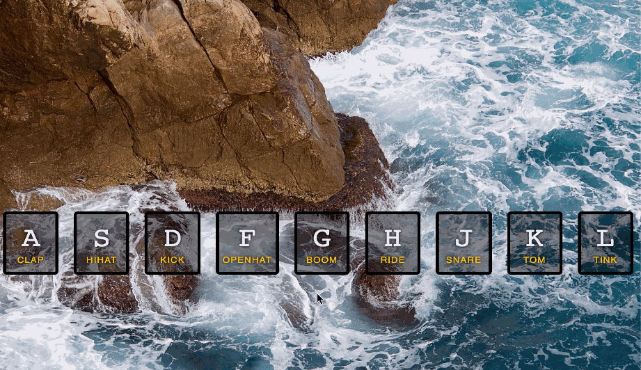

# 01-javascript-drum-kit-hibrahi000

## This is the first project in the 30-Days of javascript challenge

#First use any browser and open the index.html page

#Then Look at the keys you need to play and once you press on the key, the corresponding sound will play and the key item on the page will turn yellow

#As shown in the following Gif File

